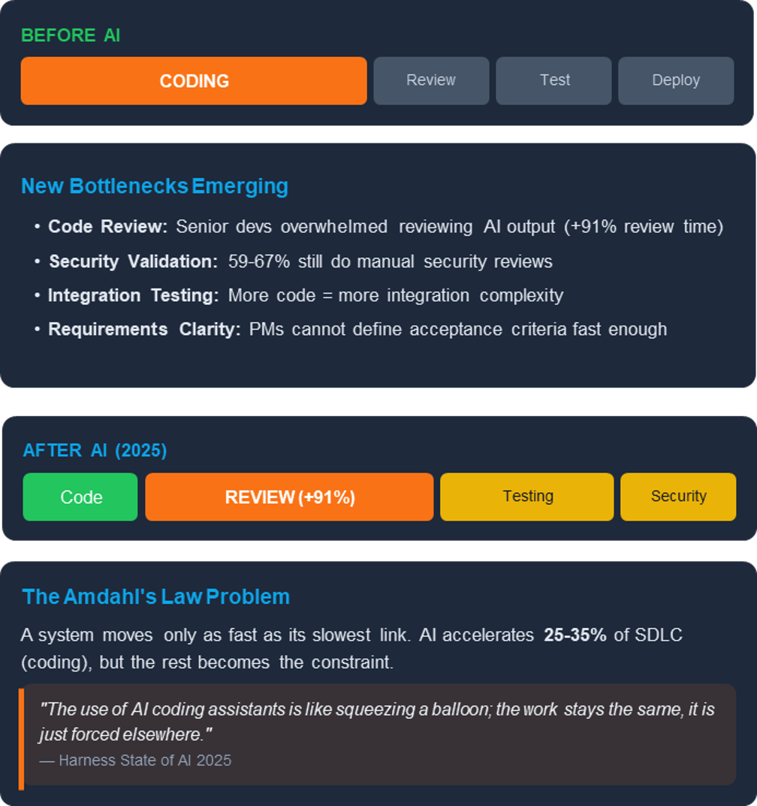
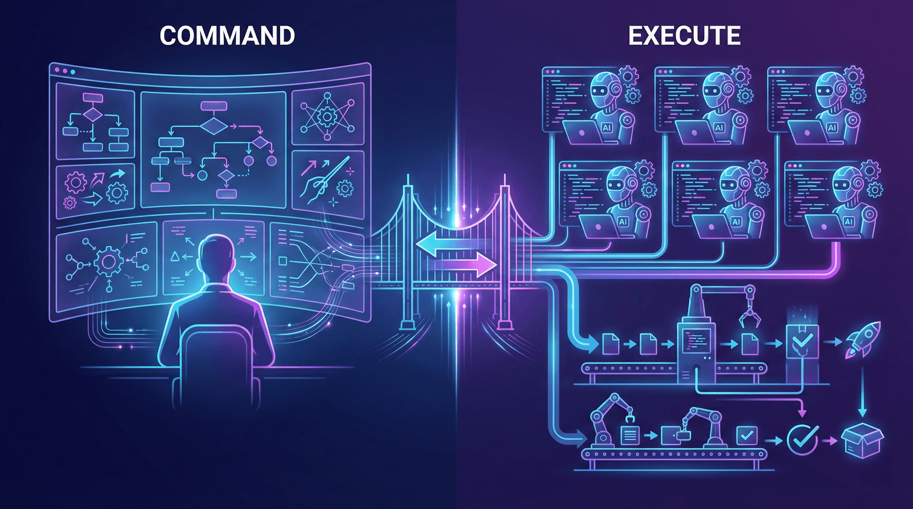
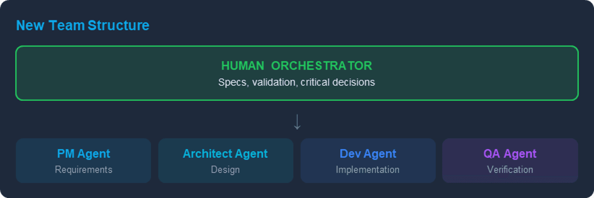

# From Vibe Coding to Spec-Driven Development

> **TL;DR:** Vibe coding (ad-hoc AI prompting) breaks down at scale. The solution is spec-driven development: treat specifications as the primary artifact, use structured protocols (MCP) for human-agent communication, and deploy specialized agents for different tasks. The result is reliable, reviewable AI-assisted engineering.

## Introduction

The first wave of AI-assisted development was exciting and messy. Developers discovered they could generate working code from simple prompts, build prototypes in minutes, and iterate through solutions at unprecedented speed. The industry became enamored with what we now call "vibe coding": ad-hoc, conversational prompting where developers rely on the intuitions of large language models to produce fragmented code.

Then the problems emerged.

That brilliant prototype? It collapsed under production load. The code that passed all tests? It harbored subtle bugs that only surfaced in edge cases. The AI that seemed to grasp your architecture? It forgot everything by the next session, making contradictory decisions without warning.

While this non-deterministic improvisation works for rapid prototyping, it proves fundamentally inadequate for shipping enterprise-grade software. The transition from AI-augmented coding to Agentic Software Engineering (SE 3.0) is exposing a brutal reality: we need structure, not vibes.

This post explores how to operationalize [the idea layer](/blog/the-idea-layer), the shift from code to ideas as the unit of work, through spec-driven development.

## The Problem

### The Vibe Coding Trap

Vibe coding represents the random, hope-it-works approach that most early AI adopters fell into. You prompt, you receive code, you test it manually, you adjust your prompt, repeat. There's no persistent context, no documented decisions, no traceable requirements.

It works remarkably well for prototypes and throwaway scripts. It fails catastrophically for business-critical systems, complex architectures, and anything requiring long-term maintenance. The AI has no memory of why it made previous decisions, no understanding of your broader system constraints, and no accountability for consistency.

### The Verification Gap

A critical finding from [SWE-Bench audits](https://arxiv.org/abs/2503.15223) reveals the fragility of the vibe coding approach: simply passing a unit test does not equate to a professional-grade fix. In rigorous retesting of "plausible" AI-generated patches, 29.6% introduced behavioral regressions or were fundamentally incorrect. The gap widens on harder benchmarks: while top models score 70-75% on SWE-bench Verified, they [drop to just 23% on SWE-bench Pro](https://arxiv.org/abs/2509.16941), which uses human-validated requirements and tests.

Unlike human developers, AI agents frequently produce "superficial patches" that satisfy a narrow test case while violating broader system architecture. They achieve the letter of the requirement while missing its spirit entirely.

The good news: the best models are rapidly improving. Top-tier models can now handle multi-file edits, sustain context across long sessions, and chain complex tool operations. But raw capability is necessary, not sufficient.

### The Speed vs. Trust Gap

The industry is now grappling with what researchers call the "Speed vs. Trust gap." Agents can author thousands of pull requests at velocities suggesting 1,000x productivity gains. But this velocity is a double-edged sword.

According to [2025 industry data](https://www.coderabbit.ai/blog/state-of-ai-vs-human-code-generation-report), AI-generated pull requests contain 1.7x more issues than human-written code, with the 90th percentile reaching 26 issues per change. Meanwhile, human review capacity has remained flat even as [AI-assisted commits now represent 41% of all commits](https://pullflow.com/state-of-ai-code-review-2025). We haven't eliminated the coding bottleneck. We've simply traded it for a verification bottleneck.

High velocity without reliability is worse than useless. It's actively harmful.



## The Solution

### The Vision: Humans Command, Agents Execute

The Structured Agentic Software Engineering (SASE) vision starts with a simple acknowledgment: humans and AI agents have fundamentally different cognitive profiles. Rather than forcing one to mimic the other, we need two distinct workbenches designed to leverage their respective strengths.

The **Command Environment** is where the human "Agent Coach" operates. The focus is strategic intent, mentorship, and orchestration. Humans excel at contextual judgment, ethical reasoning, and answering "why" questions.

The **Execution Environment** is where AI teammates operate. The focus is high-speed, tireless execution. Agents excel at computational efficiency, massive parallelism, and answering "how" questions.

This duality transforms the developer's role from code writer to agent orchestrator. The new developer defines strategy, provides mentorship, and validates outcomes rather than typing implementation details.



But a vision needs implementation. How do we actually build systems where humans command and agents execute reliably?

### The Implementation: Spec-Driven Development with BMAD

[BMAD](https://github.com/bmad-code-org/BMAD-METHOD) (Breakthrough Method for Agile AI-Driven Development) operationalizes the SASE vision through one core insight: **specifications become the primary artifact**, not an afterthought.

Traditional development treats specs as inputs that eventually become code. BMAD flips this. The specification is the living document, the single source of truth. Code becomes something compiled from the spec.

This shift changes everything about AI-assisted development:
- **Context persists.** Instead of rebuilding context every session, the spec carries forward everything the AI needs.
- **Hallucination decreases.** When the AI has detailed specs to follow, it builds what's documented instead of inventing features.
- **Consistency improves.** Multiple sessions, developers, and agents all working from the same spec produce coherent systems.
- **Reviews accelerate.** Stakeholders approve specs before code exists, catching misalignments when they're cheap to fix.

BMAD also addresses the "logic collapse" problem through Context Sharding. This technique breaks monolithic documents into atomic story files. Each contains only the specific context, architectural snippets, and acceptance criteria required for a single task. This prevents the "needle in a haystack" failures of large context windows while achieving 90% savings on token consumption.

With specs as the foundation, we need a way for agents to communicate with humans and tools. That's where protocols come in.

### The Communication Layer: Model Context Protocol

The [Model Context Protocol](https://modelcontextprotocol.io/) (MCP) provides the communication standard that makes human-agent collaboration possible. It defines how context flows between components of an agentic system.

Rather than ad-hoc prompting, MCP creates formalized channels for information exchange. Agents can request specific resources, invoke tools, and escalate to human oversight through well-defined interfaces. Think of it as the API layer between your agent fleet and everything else: databases, external services, and crucially, human decision-makers.

This standardization enables a counterintuitive but powerful shift in how we think about human-agent interaction.

### The Interaction Model: Humans as Callable Endpoints

Here's the philosophical leap: within the Agent Execution Environment, the human becomes a specialized tool. Not a supervisor watching over the agent's shoulder, but a callable endpoint that the agent invokes when it needs capabilities the model lacks.

This isn't degrading to humans. It's empowering. It formalizes the human's role as the source of strategic authority while freeing them from implementation tedium. The agent handles execution; the human handles direction.

This model is operationalized through two structured artifacts:

**Consultation Request Pack (CRP):** When an agent encounters ambiguity or faces a strategic trade-off it cannot resolve autonomously, it generates a CRP. This is a structured escalation, not a vague "I'm confused" message.

A CRP includes:
- The specific decision point requiring human input
- Options the agent has identified
- Trade-offs for each option
- Information the agent needs to proceed

The human responds with a decision, and the agent continues with full context preserved.

Here's a real example from BMAD's developer agent when it can't find a ready story:

```
📋 No ready-for-dev stories found in sprint-status.yaml

**What would you like to do?**
1. Run `create-story` to create next story from epics
2. Run `validate-create-story` to improve existing stories
3. Specify a particular story file to develop
4. Check sprint-status file to see current progress

💡 Tip: Stories in ready-for-dev may not have been validated.
```

The agent presents the situation, offers numbered options with context, and waits. No guessing, no proceeding blindly.

**Merge-Readiness Pack (MRP):** Upon task completion, the agent delivers an MRP, a structured evidence bundle designed for rapid human verification.

An MRP includes:
- Test execution logs
- Rationale for implementation decisions
- Audit trail of changes
- Acceptance criteria cross-reference

Here's a real example from BMAD's code review agent presenting findings:

```
🔥 CODE REVIEW FINDINGS

**Story:** 1-2-user-authentication.md
**Issues Found:** 2 High, 3 Medium, 1 Low

## 🔴 CRITICAL ISSUES
- Tasks marked [x] but not actually implemented
- Acceptance Criteria not implemented

## 🟡 MEDIUM ISSUES
- Files changed but not documented in File List
- Poor test coverage

**What should I do with these issues?**
1. Fix them automatically
2. Create action items for later
3. Show me details
```

The human sees categorized findings with severity levels, can drill into details, and chooses next steps. Code review becomes verification, not archaeology.

This transforms code review from archaeology (digging through changes to understand intent) into verification (confirming documented intent matches implementation).

With the interaction model defined, the next question is: who are these agents, and what do they actually do?

### The Team: Specialized Agents

Instead of one general-purpose AI attempting everything poorly, BMAD deploys specialized agents with distinct personas and capabilities. Each agent maintains a different communication style, knowledge focus, and decision-making approach.

**Strategy & Planning** agents define what to build:
- **Analyst** conducts market research and requirements gathering using frameworks like Porter's Five Forces and SWOT analysis
- **Product Manager** focuses on feature prioritization and PRD creation with a Jobs-to-be-Done methodology
- **Scrum Master** transforms plans into actionable, checklist-driven stories

**Design & Architecture** agents define how to build it:
- **Architect** handles system design and technology choices for distributed systems and cloud infrastructure
- **UX Designer** develops user flows and interface patterns through story-driven explanations
- **Tech Writer** ensures documentation follows standards and remains accessible

**Development & Quality** agents build and verify:
- **Developer** implements code with extreme focus, speaking in file paths and acceptance criteria IDs
- **Test Architect** designs test strategies, preferring lower test levels where possible
- **Quick Flow Solo Dev** handles fast-track work with minimum ceremony

Each agent thinks differently. The Architect thinks in systems and trade-offs. The Developer thinks in code and edge cases. The PM thinks in user value and priorities. This specialization mirrors how human engineering organizations work, but with agents that can be instantiated on demand and run in parallel.



This new paradigm doesn't just change how we build. It changes what "good code" even means.

### The Trade-offs: Rethinking Clean Code

Agentic Software Engineering forces us to reconsider long-standing dogmas. The [GitClear 2025 report](https://www.gitclear.com/ai_assistant_code_quality_2025_research) notes a sharp increase in code duplication since the rise of AI assistants. In SE 3.0, the DRY principle (Don't Repeat Yourself) may be intentionally reversed.

Code cloning, while a maintenance nightmare for humans, becomes a viable strategy for agentic fleets. It simplifies an agent's reasoning by providing self-contained logic. The traditional downside of updating all instances becomes trivial for machines that can modify thousands of files simultaneously.

However, this flexibility demands stricter guardrails elsewhere. Agents perform best with strict type systems like Rust and TypeScript, where the compiler acts as a tireless partner preventing the logic errors that models frequently introduce. The rules change, but discipline remains essential.

### The Model Matters

Not all models are created equal for agentic workflows. Traditional coding benchmarks test isolated tasks, but spec-driven development demands something different: sustained multi-step execution, tool chaining, and long-horizon coherence.

In practice, frontier models like Claude Opus and GPT-5 excel where it matters for spec-driven workflows. They maintain context across sprawling codebases, chain multiple actions without losing track, and backtrack when necessary. The best can sustain focus on complex, multi-step tasks for extended sessions while using fewer tokens to achieve the same results.

For spec-driven development, model choice directly impacts viability. Weaker models struggle with long PRDs, complex architectural constraints, and multi-file changes. The best models can maintain coherence across extended contexts, follow intricate specifications, and produce code that actually matches documented intent.

The gap between models compounds across an agentic workflow. An agent that loses context after 10 steps requires constant human intervention. One that maintains coherence for hundreds of steps can actually deliver on the promise of autonomous execution.

## Conclusion

We are not merely automating coding tasks; we are reshaping the landscape of software production. The transition to SE 3.0 marks a shift from writing code to orchestrating agents, from implementation to strategy, from typing to mentoring.

The skills that matter are changing. Future practitioners must develop a "sixth sense for cognitive dissonance" in AI outputs, the ability to detect when agents have gone astray despite appearing confident. They need to master specification writing, agent orchestration, and evidence-based verification rather than syntax and algorithms.

The 1000x productivity gains are real, but only for those who learn to orchestrate rather than merely prompt.

The vibe coding era was fun. The spec-driven era is professional.

Are you ready to stop coding and start orchestrating?

---

## Resources

### Research & Data (2025)

- [Are "Solved Issues" in SWE-bench Really Solved Correctly?](https://arxiv.org/abs/2503.15223) - March 2025 empirical study revealing the 29.6% behavioral regression rate
- [State of AI vs Human Code Generation](https://www.coderabbit.ai/blog/state-of-ai-vs-human-code-generation-report) - CodeRabbit analysis showing AI PRs contain 1.7x more issues
- [State of AI Code Review 2025](https://pullflow.com/state-of-ai-code-review-2025) - Industry data on AI adoption and the review gap
- [AI Copilot Code Quality: 2025 Data](https://www.gitclear.com/ai_assistant_code_quality_2025_research) - GitClear's analysis of 211M lines showing 4x growth in code clones

### Frameworks & Tools

- [BMAD Method](https://github.com/bmad-code-org/BMAD-METHOD) - Open-source spec-driven, multi-agent development framework
- [Model Context Protocol](https://modelcontextprotocol.io/) - Anthropic's standard for AI-tool communication
- [Spec Kit](https://github.com/github/spec-kit) - Open-source lightweight spec-driven development toolkit

### Further Reading

- [The Idea Layer](/blog/the-idea-layer) - The conceptual foundation for spec-driven development: why we're shifting from code to ideas as the unit of work
- [Comprehensive Guide to Spec-Driven Development](https://medium.com/@visrow/comprehensive-guide-to-spec-driven-development-kiro-github-spec-kit-and-bmad-method-5d28ff61b9b1) - Comparing Kiro, GitHub Spec Kit, and BMAD
- [SDD Framework Comparison](https://redreamality.com/blog/-sddbmad-vs-spec-kit-vs-openspec-vs-promptx/) - BMAD vs Spec Kit vs OpenSpec vs PromptX
- [Applied BMAD: Reclaiming Control in AI Development](https://bennycheung.github.io/bmad-reclaiming-control-in-ai-dev) - Real-world application patterns
- [BMAD Method Guide](https://redreamality.com/garden/notes/bmad-method-guide/) - Step-by-step implementation reference
